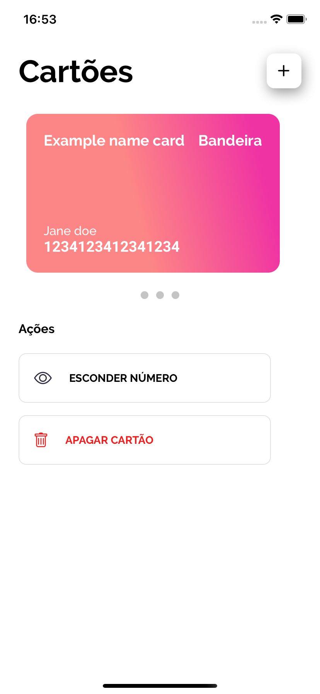
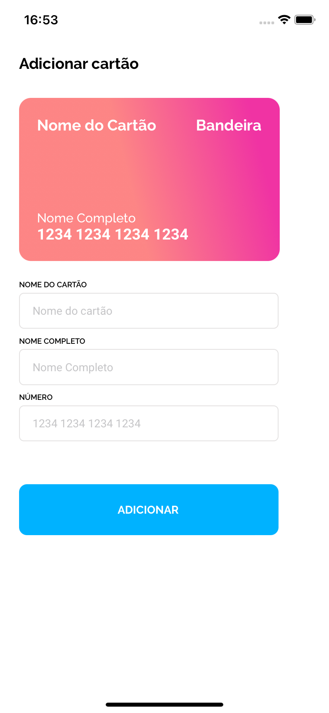

<h1 align="center"> Carteira Digital </h1>

<h3>💻 Sobre o projeto</h3>
<p>O projeto é uma carteira digital fictícia onde você pode criar ou apagar um cartão e esconder os números.</p>


|                             |                             | 
| :-------------------------- | :-------------------------: | 
|  |  
                          


<h3>🔨 Tecnologias</h3>  
<p>As seguintes ferramentas foram usadas na construção do projeto:</p>
<ul>
  <li><a href="https://reactnative.dev/">React Native</a></li>
  <li><a href="https://expo.io/">Expo</a></li>
</ul>

### Como rodar este projeto:
 ```bash
 # Clone este repositório 
 $ git clone https://github.com/mrspaiva/teste-proft.git
 
 # Instale todas as dependências
 $ yarn
    ou
 $ npm install
 
 # Rode o app com o Expo
 $ expo start
 ```

<h3>📝 Licença</h3>
<p>Este projeto está sob licença <a href="./LICENSE">MIT</a></p>
